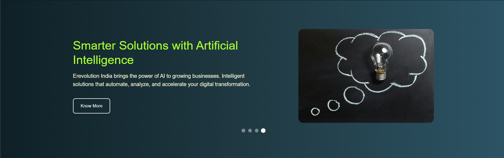
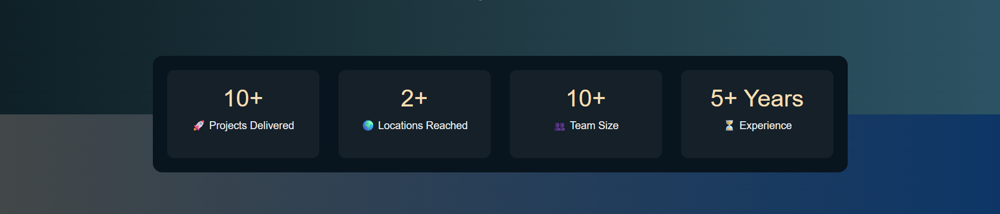
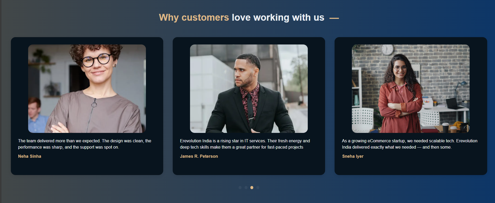
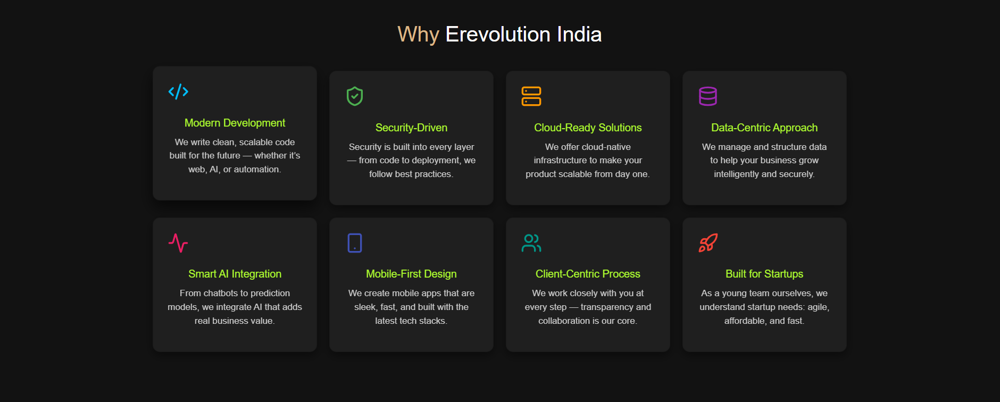
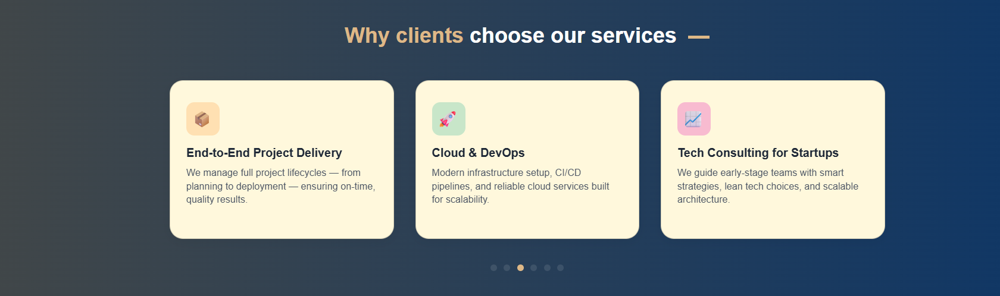
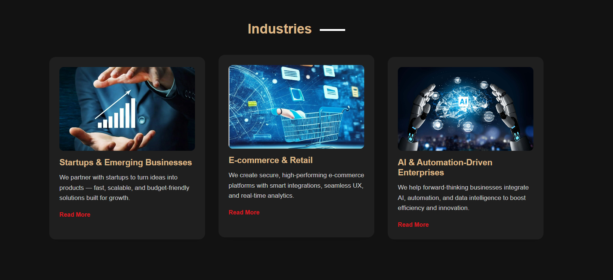
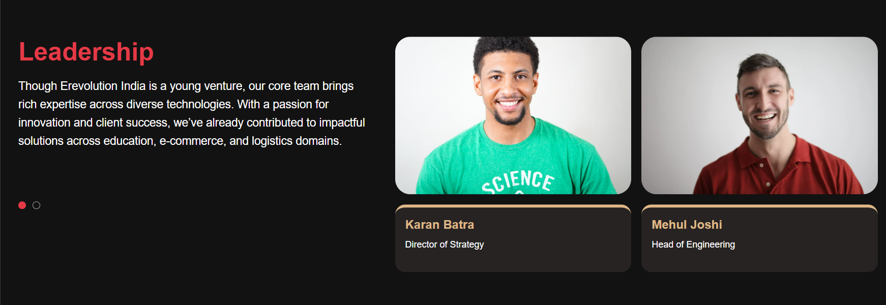

# Erevolution India

Erevolution India is a modern application built using Frontend in **Vue.js** and **Sass**, designed to provide a seamless and dynamic user experience. The project aims to showcase various sections and components that can be easily reused across different pages. Currently, it includes a Home Page layout as the structure of the app, and a set of reusable components to speed up development for other pages.

This project follows a modular structure to ensure maintainability, scalability, and flexibility for future enhancements.

---
## Commands to run the project
1.  Clone the Project
git clone https://github.com/amanuniyal123a/Erevolution_India.git
cd Erevolution_India

2.  Install Node.js Dependencies for Vue 3 Frontend

npm install
npm run dev 

 3. Serve Laravel 
 php artisan serve

## Features

- **Modular Component Design**: Reusable components for various sections and UI elements.
- **Home Page Layout**: Ready-to-use layout with a clean and organized design.
- **Responsive Design**: Built to look great on all screen sizes and devices.
- **Customizable Styles**: Use of Sass for better management and customization of styles.

---

## Project Frontend Structure

The frontend is structured to separate concerns and organize files for better scalability. Here's an overview of the directory structure:
This is a Vue.js based frontend project with a focus on reusable components, layouts, and sections. Sass is used for styling.

### Key Folders and Files:

- **`js/`**: Contains all JavaScript-related files.
  - **`components/`**: The main folder for Vue components.
    - **`layouts/`**: Contains layout components such as Header, Footer, and MainLayout.
    - **`pages/`**: Contains page-level components (e.g., `home.vue`).
    - **`sections/`**: Contains reusable sections like `HeroSection`, `TestimonialSlider`, `CaseStudies`, etc.
    - **`ui/`**: Contains small UI components like `ServiceStats`.
  - **`App.vue`**: The root Vue component for the app.
  - **`router/`**: Contains routing configuration (`index.js`).
  - **`app.js`**: The entry point JavaScript file.
  - **`bootstrap.js`**: For setting up necessary initializations.

- **`sass/`**: Contains the styles for the app.
  - **`_variables.scss`**: The file where all the Sass variables are defined.
  - **`app.scss`**: The main Sass file for global styles.

## Sections

- **Header**

The header is a sticky navigation bar that stays visible as users scroll.

The left side features the Erevolution India logo.

The center contains the main navigation menu.

The right side includes a call-to-action button, encouraging user interaction.
This layout ensures accessibility and quick navigation throughout the site.

- **Hero section**

This is the first visual impression users get on the site.

It features a dynamic slider that rotates through images and text content.

Each slide includes a headline, subtext, and a CTA button to drive conversions.

It creates an engaging introduction to our offerings and sets the tone for the rest of the site.

- **Stats section**

This section is placed between the Hero and Customer Review sections and highlights the company's key metrics and achievements.

Designed to instill trust and demonstrate credibility.

Displays data like number of clients, projects, and other relevant KPIs using a statistical UI block.

- **Customer Review section**

This section builds trust by showcasing real testimonials from satisfied clients.

Implemented using a slider, allowing for smooth navigation between multiple reviews.

Each testimonial includes the customer’s name, feedback, and possibly a profile image or designation.

- **Why Erevolution India section**

This section answers the question: "Why choose us?"

It highlights our unique advantages, such as service quality, customer support, and innovation.

Presented with icons or images alongside short descriptions to make the benefits easily digestible.

- **Service section**
 

The Service Section offers an overview of the various services provided by Erevolution India.

Each service is showcased with a title, description, and image/icon.

A carousel/slider is used here for an interactive experience, allowing users to explore services efficiently.

- **Industries section**

This section presents the domains and industries where Erevolution India has expertise.

Helps users quickly understand whether the company aligns with their business sector.

Each industry is visually represented and accompanied by a short descriptive label.

- **Case study section**

The Case Study Section highlights real-world examples of successful implementations or trending topics.

Provides in-depth insights into the challenges faced, solutions provided, and outcomes achieved.

Serves as proof of competence and thought leadership.

- **Leadership section**
  

 The Leadership Section introduces users to the key figures and inspirational leaders who guide Erevolution India.

Helps humanize the brand by showcasing the people behind it.

Includes names, designations, and brief bios, possibly with images, all displayed in a clean slider layout. 